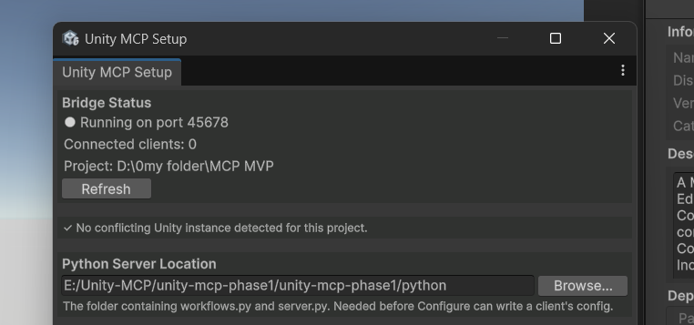
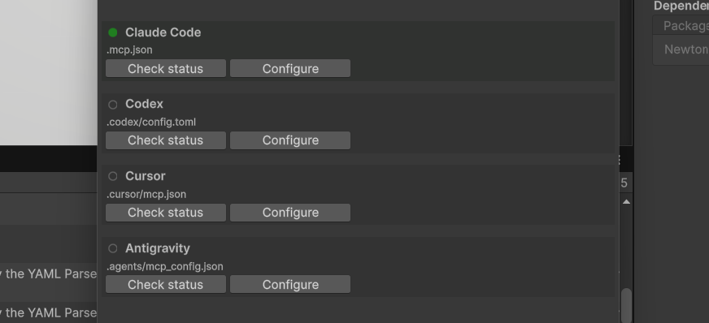
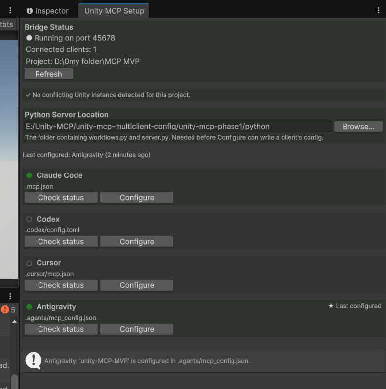
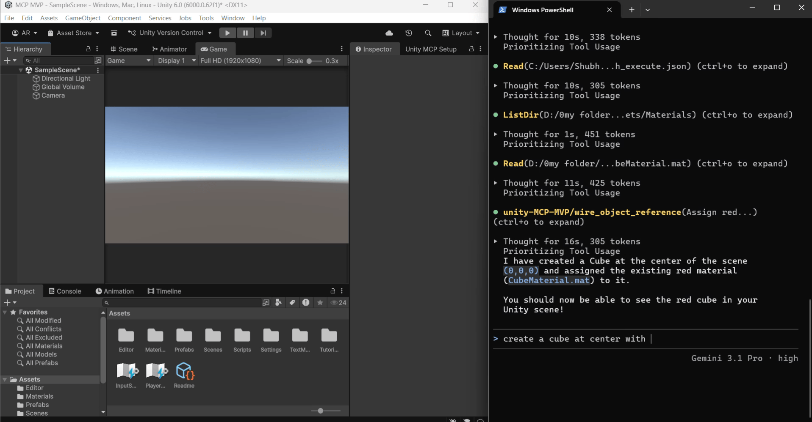
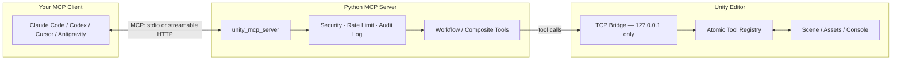

<!-- markdownlint-disable MD033 MD041 -->
<div align="center">

# Unity MCP Bridge

**Give your AI coding assistant real hands inside the Unity Editor.**

[Model Context Protocol](https://modelcontextprotocol.io) server + Editor bridge that lets
Claude Code, Codex, Cursor, Antigravity, or any MCP-compatible client create GameObjects,
write scripts, wire physics, build UI, light scenes, bake NavMeshes, and orchestrate entire
gameplay systems — directly in a running Unity project, with real safety guardrails.

[](unity/com.unitymcp.bridge/LICENSE.md)
[](unity/com.unitymcp.bridge/package.json)
[](python/requirements.txt)
[](python/unity_mcp_server/http_transport.py)
[](docs/tool-catalog.md)

[Quick start](#quick-start) · [Features](#features) · [Tool catalog](#tool-catalog) · [Architecture](#architecture) · [Security](#security)

</div>

<p align="center">
  
  <br>
  <sub>The in-Editor Setup window — live bridge status, per-client configuration, at a glance.</sub>
</p>

---

## Why Unity MCP Bridge

Most "AI + Unity" integrations stop at generating a C# snippet you paste in yourself. This
one closes the loop: your assistant calls real Editor APIs, sees the real result (hierarchy,
console, compile status), and iterates — the same way a human developer works inside the
Editor, just driven by natural language.

- **312 tools across 26 groups** — from atomic primitives (`create_gameobject`, `add_component`)
  to full gameplay systems (FPS controllers, enemy AI, save systems, procedural level layout).
- **Safety by design, not by convention** — destructive actions require explicit confirmation,
  every call is audit-logged, filesystem access is sandboxed to `Assets/`, and the network
  bridge never leaves `127.0.0.1` without an explicit auth token.
- **Works with the client you already use** — one-click configuration for Claude Code, Codex,
  Cursor, and Antigravity, or point any MCP client at the server manually.
- **Built for real projects, not demos** — multi-instance conflict detection, session tokens,
  tool-group scoping to keep context focused, and a visual builder for composing your own
  tools without writing code.

## Features

### 🧩 312 tools, 26 groups, one bridge

| Category | Groups | Highlights |
|---|---|---|
| **Core scene work** | `core`, `scene` | GameObjects, transforms, hierarchy queries, undo/redo, multi-scene management |
| **Rendering & atmosphere** | `lighting`, `cameras`, `rendering`, `vfx` | Lightmapping/GI, Cinemachine, URP post-processing (bloom, vignette, DoF, color grading), particles, decals |
| **World building** | `terrain`, `levelgen`, `navmesh`, `timeline` | Terrain sculpting/painting, procedural room/corridor generation, NavMesh baking & agents, Timeline sequences |
| **Gameplay systems** | `fps_controller`, `weapons`, `enemy_ai`, `gameplay` | First-person rigs, hitscan/projectile weapons, patrol/chase/attack AI, save systems, inventories, doors & keys |
| **Content pipeline** | `scripting`, `assets`, `animation`, `audio`, `ui`, `input` | C# CRUD with compile-status polling, prefabs/materials, Animator/BlendTrees/IK, spatial audio & mixers, UGUI, Input System |
| **Engineering tools** | `physics`, `behavior_tree`, `inspection`, `testing`, `profiling`, `build` | Colliders/joints/raycasts, custom Behavior Trees, screenshots, Play Mode automation, profiler snapshots, Player builds |

See the full, living [**tool catalog**](docs/tool-catalog.md) for every tool, its signature, and implementation notes.

### 🛡️ Real safety guardrails

- **Confirm-to-destroy.** `delete_gameobject`, `delete_script`, `delete_asset`, and every
  other destructive tool require an explicit `confirm: true` — enforced centrally, so no
  individual tool can silently skip it.
- **Sandboxed filesystem access.** A path guard restricts every file operation to `Assets/`
  and refuses symlink/junction traversal outside it — verified against a real on-disk symlink,
  not a simulation.
- **Full audit trail.** Every tool call is logged to `Library/MCP/audit.log`.
- **Loopback-only networking.** The bridge binds `127.0.0.1` only; a fresh random session
  token is published alongside the live port so multiple Unity projects on one machine can
  never cross-connect.
- **Rate limiting and destructive-action gating** centralized in one place, not scattered
  per-tool.

### ⚙️ One-click multi-client setup

`Window → Unity MCP → Setup` writes each client's config file directly — no CLI required,
no shelling out to `claude mcp add`. Supports **Claude Code**, **Codex**, **Cursor**, and
**Antigravity**, with color-coded status (green = configured, yellow = needs attention, red =
blocked) and a configuration history so you always know what's wired up.

<p align="center">
  
</p>

### 🧠 Context-aware tool scoping

Only the `core` group is visible to your assistant by default — everything else (lighting,
weapons, terrain, animation, …) is opt-in per session via the `manage_tools` tool, so your
assistant's context stays focused on what the current task actually needs instead of 312
tool definitions at once.

### 🏗️ Visual Tool Builder — tools that build tools

`Window → Unity MCP → Tool Builder` lets you chain existing tools into a brand-new composite
tool entirely from a form: pick steps, wire arguments (literal values, `{paramName}`
references, or `{stepN.field}` to pull from an earlier step's result), name it, generate.
Validation runs against the **live tool registry** — real tools, real parameters, right now,
not a stale static list.

### 🔌 Two transports, your choice

- **stdio** (default) — what Claude Code and Codex expect out of the box, zero extra setup.
- **Streamable HTTP** — drive Unity from a different machine or share one server across
  multiple client connections. Binding beyond `127.0.0.1` is refused at startup unless an
  auth token is set — enforced in code, not just documented.

### 🩺 Built-in diagnostics

Multi-instance conflict detection catches the classic "two Unity windows open, wrong one
answering" problem and names the exact PID/port at fault. When something looks off,
`python diagnose_bridge.py /path/to/YourUnityProject` is the fastest way to check the
bridge's real state before reaching for `netstat`.

---

## Quick start

Get from a fresh clone to your assistant creating a cube in the scene in under five minutes.

### 1. Install the Unity package

**Option A — Package Manager, from disk (recommended for local dev):**

```
Window → Package Manager → + → Add package from disk...
```
Point it at `unity/com.unitymcp.bridge/package.json` in this repo.

**Option B — Package Manager, from Git URL:**

```
Window → Package Manager → + → Add package from git URL...
```
```
https://github.com/AniketRaut02/unity-mcp.git?path=/unity/com.unitymcp.bridge
```

**Option C — manual copy:**
Copy `unity/com.unitymcp.bridge/` into your project's `Packages/` folder.

> Newtonsoft Json is resolved automatically as a package dependency
> (`com.unity.nuget.newtonsoft-json`) — nothing extra to install for it.

Let Unity finish compiling. Check the Console — you should see:

```
[MCP] Listening on 127.0.0.1:<port>
[MCP] 312 tool(s) registered
```

### 2. Set up the Python MCP server

Clone this repo if you haven't already, then set up the server the bridge talks to.

**macOS / Linux (bash):**
```bash
git clone https://github.com/AniketRaut02/unity-mcp.git
cd unity-mcp/python
python3 -m venv .venv
source .venv/bin/activate
pip install -r requirements.txt
```

**Windows (PowerShell):**
```powershell
git clone https://github.com/AniketRaut02/unity-mcp.git
cd unity-mcp/python
python -m venv .venv
.venv\Scripts\Activate.ps1
pip install -r requirements.txt
```

**Windows (cmd.exe):**
```bat
git clone https://github.com/AniketRaut02/unity-mcp.git
cd unity-mcp\python
python -m venv .venv
.venv\Scripts\activate.bat
pip install -r requirements.txt
```

### 3. Connect your MCP client

Open your Unity project, then:

```
Window → Unity MCP → Setup
```

1. Set the **Python server location** — Browse to the `python` folder from step 2 (the one
   containing `server.py` and `workflows.py`).
2. Click **Configure** next to whichever client you use — **Claude Code**, **Codex**,
   **Cursor**, or **Antigravity**. This writes that client's MCP config file directly, using
   an absolute path to this project's Python interpreter and environment. No terminal
   commands needed.
3. Restart your MCP client session (a fresh Claude Code / Codex / Cursor session, so it
   re-reads the config).

<p align="center">
  
</p>

**Prefer to configure a client by hand instead?** Each client reads a small JSON (or TOML,
for Codex) file. The Setup window's Configure button writes exactly this, generated with
your project's real paths — this is what it looks like:

<details>
<summary><b>Claude Code</b> — <code>.mcp.json</code> at your project root</summary>

```json
{
  "mcpServers": {
    "unity-<YourProjectName>": {
      "command": "/absolute/path/to/unity-mcp/python/.venv/bin/python",
      "args": ["-m", "unity_mcp_server.server"],
      "env": {
        "PYTHONPATH": "/absolute/path/to/unity-mcp/python",
        "UNITY_MCP_PROJECT_ROOT": "/absolute/path/to/YourUnityProject"
      }
    }
  }
}
```
</details>

<details>
<summary><b>Cursor</b> — <code>.cursor/mcp.json</code></summary>

Same schema as Claude Code above — Cursor uses the identical `mcpServers` JSON format.
</details>

<details>
<summary><b>Antigravity</b> — <code>.agents/mcp_config.json</code></summary>

Same schema as Claude Code / Cursor.
</details>

<details>
<summary><b>Codex</b> — <code>.codex/config.toml</code></summary>

```toml
[mcp_servers.unity-<YourProjectName>]
command = "/absolute/path/to/unity-mcp/python/.venv/bin/python"
args = ["-m", "unity_mcp_server.server"]

[mcp_servers.unity-<YourProjectName>.env]
PYTHONPATH = "/absolute/path/to/unity-mcp/python"
UNITY_MCP_PROJECT_ROOT = "/absolute/path/to/YourUnityProject"
```

> Codex only loads project-scoped config for directories marked **trusted**. If the tools
> don't show up, check that first.
</details>

### 4. Create your first cube

In your freshly restarted MCP client session, ask it to do something concrete in Unity —
for example:

> "Create a red cube at the origin."

That single request typically drives two tool calls the assistant makes on your behalf:

```jsonc
// 1. create_primitive
{ "primitiveType": "Cube", "name": "RedCube", "position": [0, 0, 0] }

// 2. set_material_color (after creating/assigning a material)
{ "materialPath": "Assets/Materials/RedCube.mat", "color": [1, 0, 0, 1] }
```

Switch to Unity and you'll see the cube appear in the Scene view and Hierarchy in real
time — no manual refresh, no reimport, no copy-pasted code.

<p align="center">
  
</p>

If nothing happens: run `python diagnose_bridge.py /path/to/YourUnityProject` from the
`python/` folder — it's the fastest way to confirm the bridge is listening, the session
token matches, and your client is pointed at the right port.

---

## Tool catalog

Every tool this server exposes — grouped, typed (atomic C# vs. composite Python), and
described — lives in [`docs/tool-catalog.md`](docs/tool-catalog.md). It's kept current as
tools are added; treat it as the source of truth over anything summarized here.

Ask your assistant directly, too — `"what tool groups are available?"` calls `manage_tools`
and lists every group live from the running server.

## Architecture



Every request from your assistant flows through the security/audit layer before it ever
touches Unity, and every Unity-side call is dispatched on the main thread via
`EditorApplication.update` — the same thread the Editor's own UI runs on.

## Security

| Control | Detail |
|---|---|
| **Network exposure** | Binds `127.0.0.1` only, by default. HTTP transport across machines requires an explicit `UNITY_MCP_HTTP_TOKEN`; refused to bind wider without one. |
| **Session isolation** | Each Editor session publishes a fresh random token alongside its live port to `Library/MCP/session.json`, re-read on every reconnect — prevents cross-project connections when multiple Unity instances run on one machine. |
| **Destructive-action gating** | Centrally enforced `confirm: true` requirement on delete/apply/revert operations — no individual tool can bypass it. |
| **Filesystem sandboxing** | All file writes are contained to `Assets/`, with real symlink/junction traversal protection. |
| **Audit logging** | Every tool call, args included, is appended to `Library/MCP/audit.log`. |
| **Rate limiting** | Centralized, applied uniformly across all tools. |

Found a security issue? Please open a private report rather than a public issue — see
[Contributing](#contributing).

## Extending it

- **New Unity-side tool** — write one `[MCPTool]`-decorated static method in C#. Nothing
  else to register. Full guide: [`docs/writing-custom-tools.md`](docs/writing-custom-tools.md).
- **Chain existing tools into a new one** — either use the visual **Tool Builder**
  (`Window → Unity MCP → Tool Builder`), or hand-write a Python `@workflow` function in
  `python/unity_mcp_server/custom_workflows.py`. No Unity restart required — just reconnect
  your MCP client session.

## Requirements

- Unity **2021.3** or later
- Python **3.10+**
- One of: Claude Code, Codex, Cursor, Antigravity — or any other MCP-compatible client,
  pointed manually at the server

## Repository layout

```
unity-mcp/
├─ unity/com.unitymcp.bridge/   # the UPM package — install this into your Unity project
│  ├─ Editor/                   # C# bridge, tool registry, Setup & Tool Builder windows
│  ├─ package.json
│  └─ CHANGELOG.md
├─ python/                      # the MCP server your AI client talks to
│  └─ unity_mcp_server/
├─ docs/
│  ├─ tool-catalog.md           # every tool, grouped and described
│  └─ writing-custom-tools.md   # custom-tool authoring guide
└─ dev-tests/                   # C# logic tests, runnable without a full Unity Editor
```

## Contributing

Issues and pull requests are welcome. Before opening a PR:

```bash
bash dev-tests/csharp/run_tests.sh
cd python && python3 -m pytest
```

Please include what you verified and how — this project's history favors real, executable
verification (actual disk I/O, actual sockets, actual symlinks) over hypothetical
descriptions of intended behavior.

## License

[MIT](unity/com.unitymcp.bridge/LICENSE.md) © DarkPixelGD
</content>
